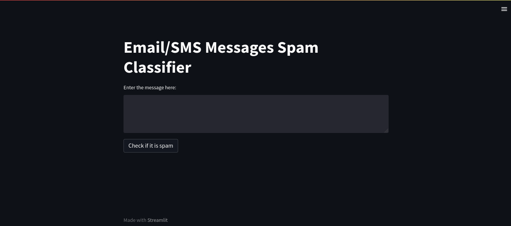
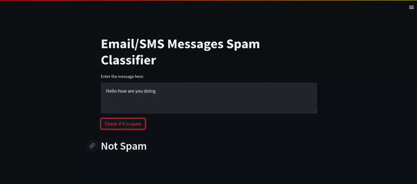

# Spam Message Classifier

> In this repo I have done an end to end spam message classifier. In the website a user can pass the message and the model will predict whether the email is spam or ham. I have used a labeled data to train my model and streamlit for the UI and deployment. 

The spam messages data contains more than 5000 labeled messages.

 

## Built With

- Python
- Streamlit

## Live Demo

[Live Demo Link](https://micky373-spam-classifier-spam-classifier-ibl2kp.streamlit.app/)

## Getting Started Locally

> git clone `https://github.com/Micky373/spam_classifier.git`

> cd spam_classifier

> pip install -r requirements.txt

> streamlit run spam_classifier.py

> Then go and on any browser put this link (http://localhost:8501/)

> Then put a message in the box.

> If you need there are some `spam` and `ham` messages in the `data` folder, you can pass those
messages in the box and check.

> Then the website will show you if the message is spam or ham.

> More clear discription about how the recommendation system was built and the API fetching can be found in the `notebooks` folder.

## Author

- GitHub: [@Micky](https://github.com/Micky373)

- LinkedIn: [Michael Tamirie](https://www.linkedin.com/in/michaeltamirie/)

## 🤝 Contributing

Contributions, issues, and feature requests are welcome!

Feel free to check the [issues page](https://github.com/Micky373/spam_classifier/issues).

## Show your support

Give a ⭐️ if you like this project!

## Acknowledgments

- Special thanks to [CampusX youtube channel](https://www.youtube.com/@campusx-official)
